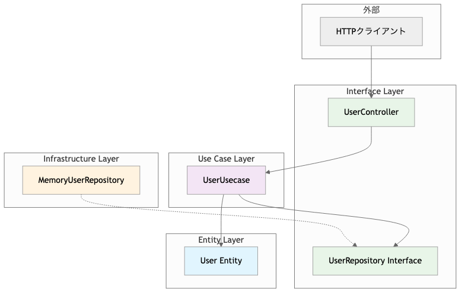

# Go クリーンアーキテクチャの例

このプロジェクトは、Go言語でクリーンアーキテクチャを実装したシンプルな例です。学習目的で作成されており、ユーザー管理システムを題材としています。

## クリーンアーキテクチャとは

クリーンアーキテクチャは、Robert C. Martin（Uncle Bob）によって提唱されたソフトウェアアーキテクチャの設計原則です。以下の特徴があります：

- **依存関係の方向性**: 外側の層は内側の層に依存するが、内側の層は外側の層に依存しない
- **テスタビリティ**: ビジネスロジックが外部依存から独立している
- **保守性**: 関心の分離により、変更の影響範囲を限定できる

## プロジェクト構造

```
├── entity/                    # エンティティ層（ビジネスエンティティ）
│   └── user.go
├── usecase/                   # ユースケース層（ビジネスルール）
│   └── user_usecase.go
├── interface/                 # インターフェース層
│   ├── controller/            # コントローラー（外部からの入力処理）
│   │   └── user_controller.go
│   └── repository/            # リポジトリインターフェース
│       └── user_repository.go
├── infrastructure/            # インフラストラクチャ層（外部システム）
│   └── persistence/
│       └── memory_user_repository.go
├── cmd/                       # メイン関数（依存性注入の設定）
│   └── main.go
├── go.mod
└── README.md
```

## アーキテクチャ構成図

### システム構成


### 依存関係の方向


詳細な構成図は `docs/` フォルダにあります：
- `docs/architecture.mermaid` - 純粋な Mermaid 図
- `docs/architecture-diagram.html` - ブラウザで開ける詳細解説付き図
- `architecture.md` - GitHub で描画される Mermaid 図（複数パターン）

## 各層の説明

### 1. エンティティ層 (Entity Layer)
- **場所**: `entity/`
- **役割**: ビジネスの核となるデータとルールを定義
- **特徴**: 他の層に依存しない、最も内側の層
- **例**: `User` エンティティとその基本的なビジネスルール

### 2. ユースケース層 (Use Case Layer)
- **場所**: `usecase/`
- **役割**: アプリケーション固有のビジネスルールを実装
- **特徴**: エンティティのみに依存し、外側の層の詳細を知らない
- **例**: ユーザーの作成、更新、削除などの業務処理

### 3. インターフェース層 (Interface Layer)
- **場所**: `interface/`
- **役割**: 外部との入出力を定義
- **構成**:
  - `controller/`: HTTP リクエストを処理し、ユースケースを呼び出す
  - `repository/`: データ永続化のインターフェースを定義

### 4. インフラストラクチャ層 (Infrastructure Layer)
- **場所**: `infrastructure/`
- **役割**: 外部システム（DB、Web フレームワークなど）との具体的な実装
- **例**: メモリ内でのユーザーデータ保存（実際のプロジェクトではDBを使用）

## 依存性注入 (Dependency Injection)

`cmd/main.go` では、依存性注入パターンを使用して各層を結合しています：

```go
// 依存関係の構築（外側から内側へ）
userRepo := persistence.NewMemoryUserRepository()      // Infrastructure
userUsecase := usecase.NewUserUsecase(userRepo)        // Use Case
userController := controller.NewUserController(userUsecase) // Interface
```

この構造により、各層は抽象（インターフェース）に依存し、具体的な実装には依存しません。

## API エンドポイント

| メソッド | エンドポイント | 説明 |
|---------|---------------|------|
| POST | `/users` | ユーザー作成 |
| GET | `/users` | ユーザー一覧取得 |
| GET | `/users/{id}` | 特定ユーザー取得 |
| PUT | `/users/{id}` | ユーザー情報更新 |
| DELETE | `/users/{id}` | ユーザー削除 |

## 実行方法

1. プロジェクトディレクトリに移動:
```bash
cd go-clean-architecture-playground
```

2. サーバーを起動:
```bash
go run cmd/main.go
```

3. API をテスト:
```bash
# ユーザー作成
curl -X POST http://localhost:8080/users \
  -H "Content-Type: application/json" \
  -d '{"name": "田中太郎", "email": "tanaka@example.com"}'

# ユーザー一覧取得
curl http://localhost:8080/users

# 特定ユーザー取得
curl http://localhost:8080/users/1

# ユーザー更新
curl -X PUT http://localhost:8080/users/1 \
  -H "Content-Type: application/json" \
  -d '{"name": "田中次郎", "email": "tanaka.jiro@example.com"}'

# ユーザー削除
curl -X DELETE http://localhost:8080/users/1
```

## クリーンアーキテクチャのメリット

1. **独立性**: ビジネスロジックが外部依存から独立
2. **テスタビリティ**: 各層を個別にテスト可能
3. **柔軟性**: データベースやWebフレームワークの変更が容易
4. **保守性**: 関心の分離により、コードの理解と変更が容易

## 学習のポイント

- **依存関係の方向**: 内側の層は外側の層を知らない
- **インターフェースの活用**: 抽象に依存し、具象に依存しない
- **単一責任の原則**: 各層が明確な責任を持つ
- **依存性注入**: 実行時に依存関係を注入する

このシンプルな例を通じて、クリーンアーキテクチャの基本概念と実装方法を学習できます。