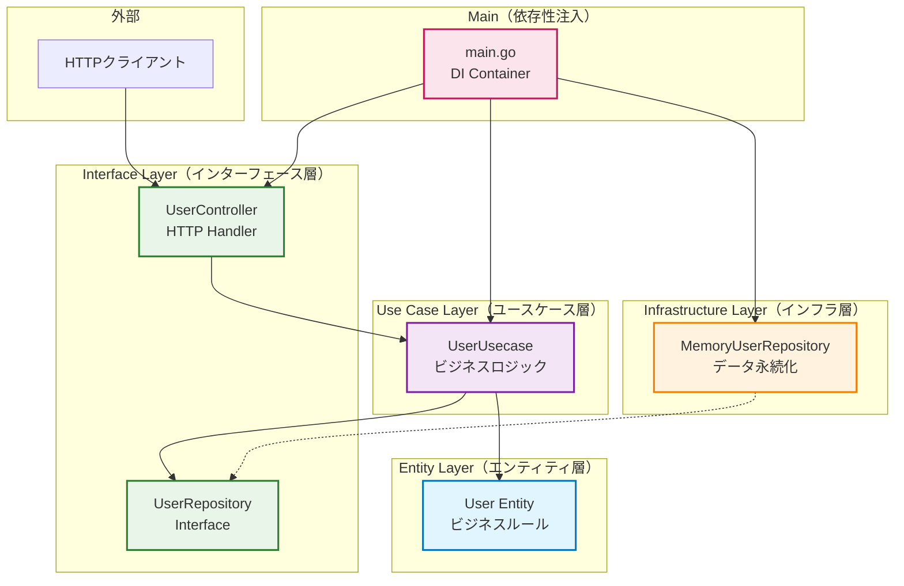
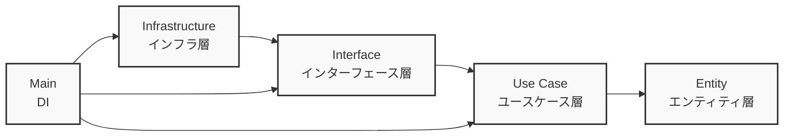
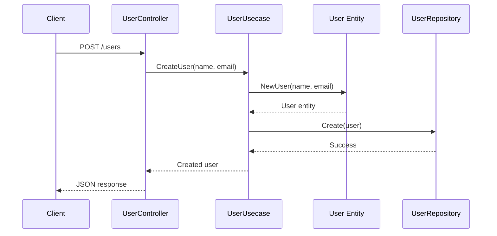

# Go クリーンアーキテクチャ構成図

## システム全体構成図



## 依存関係の方向



## データフロー（API リクエスト処理）



## レイヤー構成の詳細

```mermaid
graph TD
    subgraph "Clean Architecture Layers"
        subgraph "Entity Layer"
            E1[User Entity<br/>- ID, Name, Email<br/>- NewUser()<br/>- UpdateInfo()]
        end
        
        subgraph "Use Case Layer"
            U1[UserUsecase<br/>- CreateUser()<br/>- GetUser()<br/>- UpdateUser()<br/>- DeleteUser()]
        end
        
        subgraph "Interface Layer"
            I1[UserController<br/>- HTTP Handlers]
            I2[UserRepository<br/>- Interface Definition]
        end
        
        subgraph "Infrastructure Layer"
            F1[MemoryUserRepository<br/>- Concrete Implementation<br/>- In-memory storage]
        end
    end

    U1 --> E1
    U1 --> I2
    I1 --> U1
    F1 -.-> I2

    classDef entity fill:#e1f5fe
    classDef usecase fill:#f3e5f5
    classDef interface fill:#e8f5e8
    classDef infrastructure fill:#fff3e0

    class E1 entity
    class U1 usecase
    class I1,I2 interface
    class F1 infrastructure
```